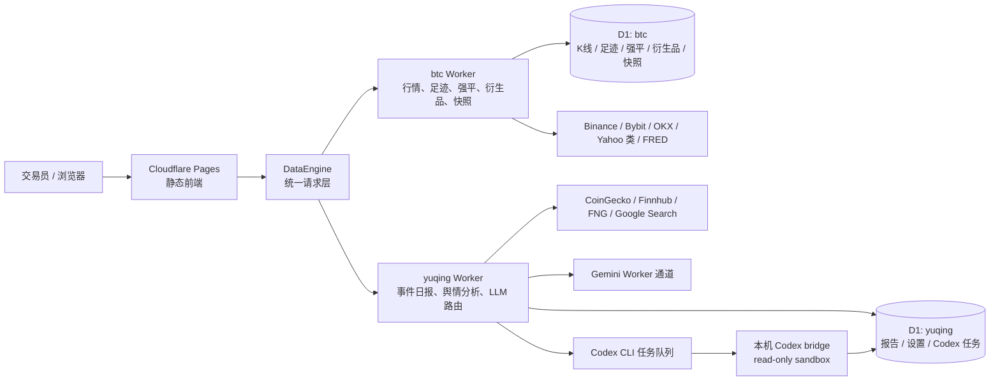
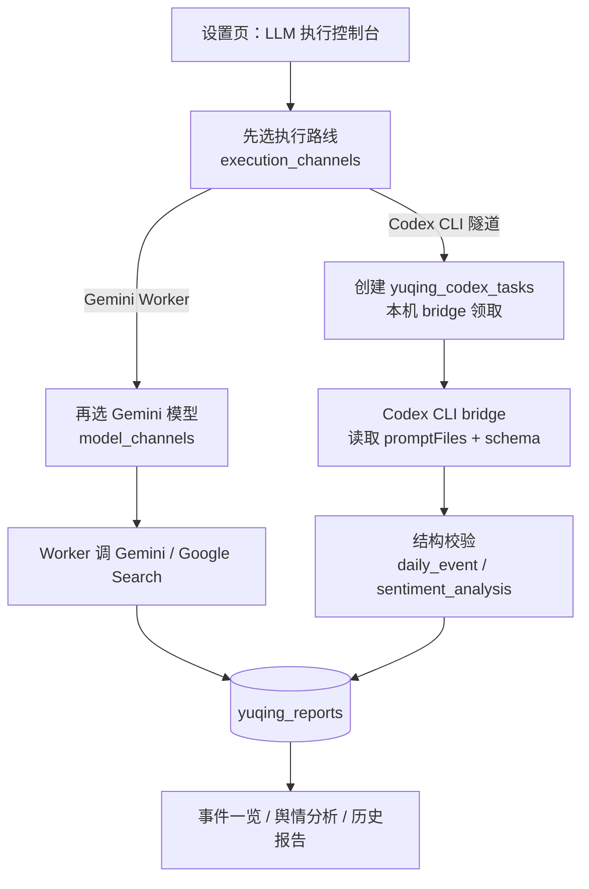
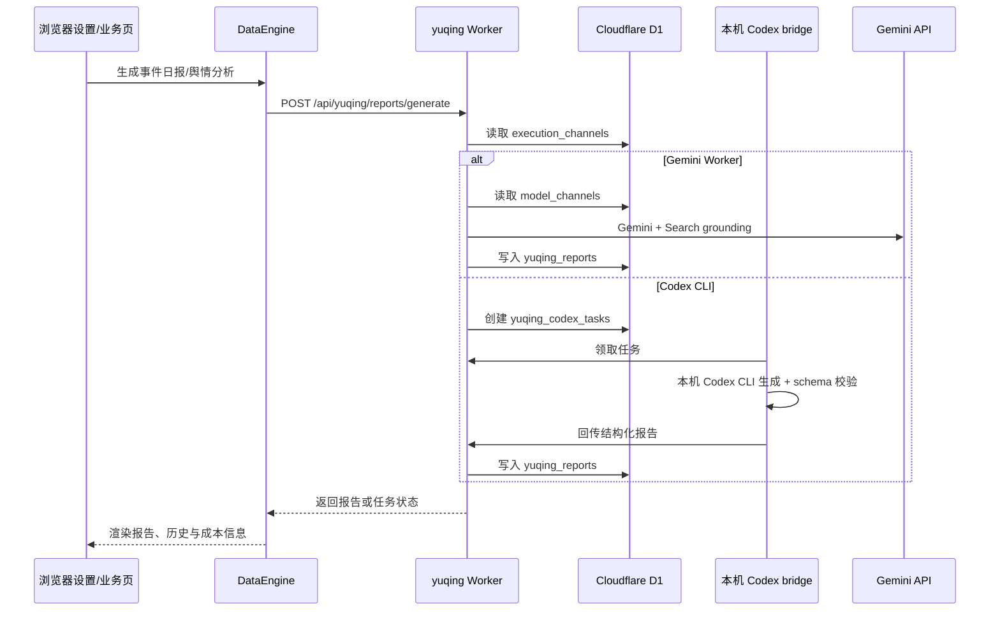

# Bit 交易决策平台（数据监测分模块）

面向个人期货交易台的 **静态 Web 控制台 + Cloudflare Workers + D1 + 本地 Codex CLI 隧道**。系统把行情、订单流、强平热力、衍生品、舆情日报和员工 Agent 的结构化输入收拢到同一套导航里，目标是把“看盘、研判、复盘、自动化报告”放进一个可验证、可部署、可回档的工作区。

## 线上入口

| 入口 | 用途 |
| --- | --- |
| <https://bitcoin.feiniwork.com/> | Cloudflare Pages 自定义域名前端 |
| <https://btc.feiniwork.com> | 行情 / D1 / 快照 Worker 默认 API 根域 |
| <https://yuqing.feiniwork.com> | 舆情日报、舆情分析、LLM 路由与 Codex 任务队列 Worker |

前端也支持通过 `window.BIT_DATA_API_BASE`、`window.BIT_YUQING_API_BASE` 覆盖默认 API 根域，便于本地或备用环境联调。

## 一图看懂



## 当前系统分层

| 层级 | 说明 | 主要文件 |
| --- | --- | --- |
| 前端壳 | Hash 路由、导航、主题、设置页、各业务页。无独立打包产物，Cloudflare Pages 直接托管仓库静态资源。 | `index.html`、`styles.css`、`js/app.js`、`js/pages/*` |
| 行情数据层 | K 线、足迹图、强平、衍生品、市场快照与员工输入快照。 | `cloudflare/binance-klines-worker.js`、`cloudflare/schema.sql`、`js/data-engine.js` |
| 舆情与 LLM 层 | 事件一览、舆情分析、日报历史、成本估算、模型路由、执行路由、Codex CLI 任务队列。 | `cloudflare/yuqing/yuqing-worker.js`、`cloudflare/yuqing/shijian/*`、`cloudflare/yuqing/fenxi/*` |
| 本地低成本执行 | Web 只创建受限任务，实际由本机 bridge 调用 Codex CLI，再把结构化结果写回 Worker/D1。 | `scripts/codex-cli-bridge.cjs`、`scripts/codex-schemas/*` |
| 校验与部署 | 语法、指标数学、足迹聚合、快照契约、Worker API、舆情双通道、Cloudflare Pages 清理。 | `scripts/verify-*.cjs`、`scripts/smoke-api.cjs`、`scripts/prune-pages-deployments.cjs` |

## LLM 双执行通道

系统把“走哪个执行器”和“选哪个 Gemini 模型”拆开维护：



设计原则：

- **Gemini Worker** 是正式自动化路线，适合定时任务、线上自动报告和需要 Google Search grounding 的场景。
- **Codex CLI 隧道** 是开发期和低成本人工触发路线，适合在本机运行、节省 API 花费，并保持网页不能下发任意 shell。
- 当某个页面切到 Codex CLI 时，Gemini 模型选择会保留但不参与该次生成；切回 Gemini Worker 后才显示对应模型细调。

## 功能地图

| 导航区域 | 当前能力 |
| --- | --- |
| 市场监测 | 行情工作台、多周期结构、指标数学、订单流与足迹图、强平雷达、热力压力矩阵、衍生品面板。 |
| 舆情与事件 | 事件日报、实时扫描、GitHub 工具雷达、趋势线索、舆情二次分析、报告历史、成本估算。 |
| 智囊团 | 首席策略官、环境评估员、盘口流动性官、衍生品情报官、风控官的页面和输入契约逐步接入。 |
| 交易执行 | 仓位与风险计算器已接入；策略模板库、订单草稿台、当前持仓为预留扩展区。 |
| 复盘系统 | 交易日志、每日复盘、绩效统计、错误模式为预留区，后续会接入员工观点和历史归因。 |
| 系统 | 设置页、主题、D1 运维、Cloudflare 定点说明、LLM 执行控制台、路线图占位。 |

保留 `PLANNED`、占位 UI 和预留结构是本项目约定。未完成模块只在对应功能完整可用后再移除占位。

## 数据与报告流



## 本地开发

```bash
npm install
npm run dev:local
```

常用入口：

- `http://127.0.0.1:5173/index.html#chart`
- `http://127.0.0.1:5173/index.html#events`
- `http://127.0.0.1:5173/index.html#news-analysis`
- `http://127.0.0.1:5173/index.html#settings`

若 5173 被占用，Vite 会提示其他端口；也可以手动传 `-- --host 127.0.0.1 --port 5188`。

## 验证矩阵

| 场景 | 命令 |
| --- | --- |
| 通用语法检查 | `npm run lint` |
| 部署前总闸 | `npm run build` |
| 指标数学 | `node scripts/verify-indicator-math.cjs` |
| 足迹图 / 订单流 / 强平 | `npm run verify:footprint` |
| 行情 Worker 与静态壳探活 | `npm run verify:api` |
| 衍生品 Worker | `npm run verify:derivatives` |
| 舆情、LLM 路由、Codex bridge 契约 | `npm run verify:yuqing` |
| Fibonacci 统计验证 | `npm run verify:fib` |

`npm run build` 等价于 `verify:all`，也是 Cloudflare Pages 部署前总闸。

## Cloudflare 部署

当前仓库规则：**完成仓库改动并验证通过后，默认部署受影响的 Cloudflare 面**；GitHub 仍只在用户明确指令下 commit/push。

| 影响面 | 部署动作 |
| --- | --- |
| 前端、静态资源、规则/文档、脚本、共享逻辑 | `npm run deploy:pages` |
| 行情 Worker | 在 `cloudflare/` 下部署默认 Worker |
| 舆情 Worker | 在 `cloudflare/` 下部署 `wrangler.yuqing.toml` 对应 Worker |
| 同时影响 Pages 与 Worker | 先 Worker，后 Pages |
| D1 schema / 远程迁移 | 仅在用户明确要求时执行远程 D1 命令 |

前端、样式、页面入口或关键 JS 改动后，必须同步提升 `index.html` 中对应资源的 `?v=`，避免自定义域名和边缘缓存继续加载旧资源。

## GitHub 工作流

- 默认分支：`main`
- 远端：`origin` -> `https://github.com/Feini2002/Bitcoin.git`
- 默认不自动 commit / push / 开 PR；只有用户明确要求时执行。
- 推送前先确认工作区范围，避免把 `.env`、本地日志、临时截图等文件提交。
- 本仓库的 GitHub 备份说明见 `GITHUB-BACKUP-WORKFLOW.md`。

## 安全边界

- `.env`、`.codex-bridge.env`、`.wrangler/`、`.codex/`、`.codex-bridge/`、`node_modules/` 不应进入仓库。
- Codex CLI bridge 默认受限运行，不允许网页下发任意 shell。
- D1 远程 schema 迁移、远程写表、删除、`git reset` 等高风险操作必须显式确认。
- 网络实时数据不等于稳定测试结论；交易所、Worker、Binance、Bybit、Cloudflare 状态都可能随时间变化。

## 重要文件速查

| 文件 | 作用 |
| --- | --- |
| `AGENTS.md` | Codex 在本仓库工作时必须遵守的主规则 |
| `.cursorrules` | Cursor / Codex 共享协作约束 |
| `js/data-engine.js` | 前端到 Worker 的统一数据层 |
| `js/pages/settings.js` | 设置页、D1 运维、LLM 执行控制台 |
| `cloudflare/binance-klines-worker.js` | 行情、足迹、强平、衍生品和快照 Worker |
| `cloudflare/yuqing/yuqing-worker.js` | 舆情日报、LLM、执行路由、Codex task Worker |
| `scripts/codex-cli-bridge.cjs` | 本地 Codex CLI 任务领取与回写 |
| `scripts/verify-yuqing-reports.cjs` | 舆情与双通道端到端契约校验 |

## 声明

本项目为私有交易决策辅助系统。页面展示、报告和模型输出均不构成投资建议；第三方行情源、交易所接口和模型服务受各自服务条款约束。
